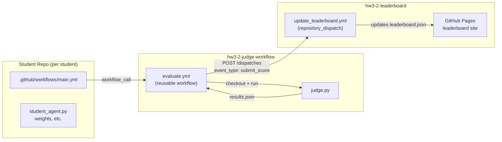

# LevDoom Seek and Slay — Judge Workflow

This repository contains the automated evaluation system for the LevDoom Seek and Slay competition. When a student pushes to their submission repo, GitHub Actions runs this judge and submits the result to the leaderboard.


## Repository overview




## How evaluation works

1. The student's repo is checked out to `./student/`.
2. Dependencies are installed from `student/requirements.txt`.
3. `judge.py` loads `student/student_agent.py` and instantiates `StudentAgent` **once**.
4. For each level, the agent is run on 5 fixed seeds. `reset()` is called before every episode.
5. If the agent's mean kills fall below a level's threshold, evaluation stops early.
6. Results are submitted to the leaderboard.

### Levels

| Level | Environment ID | Map | Threshold (mean kills) |
|-------|---------------|-----|------------------------|
| 0 | `SeekAndSlayLevel0-v0` | `default` | 18 |
| 1 | `SeekAndSlayLevel1_6-v0` | `mixed_enemies` | 9 |
| 2 | `SeekAndSlayLevel3_1-v0` | `blue_mixed_resized` | 9 |
| 3 | `SeekAndSlayLevel2_3-v0` | `red_mixed_enemies` | 9 |
| 4 | `SeekAndSlayLevel4-v0` | `complete` | — (final level) |

### Scoring

Leaderboard ranks are determined by **total score** (higher is better):

$$
\text{Total Score}=\sum_{l=0}^4 w_l\times(\text{kills}\times1.0+\text{health}\times 0.01+\text{ammo}\times 0.005)
$$

Each level has a difficulty weight:

| Tier   | Levels ($l$) | Weight ($w_l$) |
| ------ | ------------ | -------------- |
| Easy   | 0            | ×1             |
| Medium | 1, 2, 3      | ×2             |
| Final  | 4            | ×3             |

$\text{kills}$ is the dominant factor. $\text{health}$ (0–100) and $\text{ammo}$ (0–200) each contribute at most 1 point per level before weighting. All values are the mean across the 5 seeds for that level.
## Student submission guide

### Required files

Your repo must contain:

| File | Purpose |
|------|---------|
| `student_agent.py` | Your agent implementation (see below) |
| `requirements.txt` | Python dependencies your agent needs |
| `meta.xml` | Your student ID |
| `.github/workflows/main.yml` | Workflow that triggers evaluation on push |

### Setting up `.github/workflows/main.yml`

Create this file in your repo to automatically evaluate your agent whenever you push to `main`:

```yaml
name: Submit to Leaderboard

on:
  push:
    branches:
      - main

jobs:
  evaluate:
    uses: ntu-drl-2026-spring-hw3/hw3-2-judge-workflow/.github/workflows/evaluate.yml@main
```

### Implementing `student_agent.py`

Define a class named `StudentAgent` with three methods:

| Method | When called | Purpose |
|--------|-------------|---------|
| `__init__(self, action_space)` | Once at startup | Load model weights, build network, etc. |
| `reset(self)` | Before every episode | Clear per-episode state (frame stack, hidden states, etc.) |
| `act(self, obs) -> int` | Every timestep | Return an integer action |

`reset()` is optional — if you have no per-episode state to clear, you can omit it.

```python
class StudentAgent:
    def __init__(self, action_space):
        # Called once. Load weights here.
        self.action_space = action_space

    def reset(self):
        # Called before each episode. Clear internal state here.
        pass

    def act(self, obs) -> int:
        # Called every timestep. Return an integer action.
        return self.action_space.sample()
```

### Loading model weights or other files

The judge does **not** run from your repo's directory, so bare relative paths will fail.
Always use `Path(__file__).parent` to reference files in your repo:

```python
from pathlib import Path
_DIR = Path(__file__).parent

class StudentAgent:
    def __init__(self, action_space):
        self.model = torch.load(_DIR / "weights.pth")  # correct
        # torch.load("weights.pth")                    # FileNotFoundError
```

### `meta.xml` format

Replace `your_student_id` with your actual student ID. This file is used by the judge to identify you when submitting results to the leaderboard.

```xml
<submission>
  <info>
    <name>r00000001</name>
  </info>
</submission>
```
